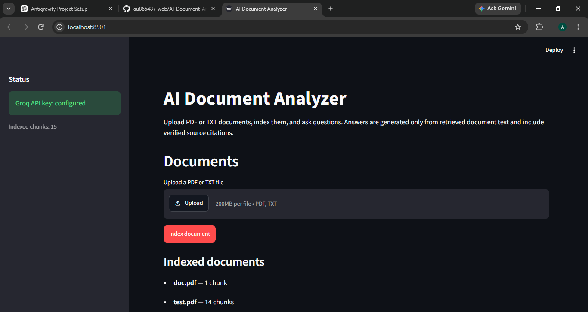
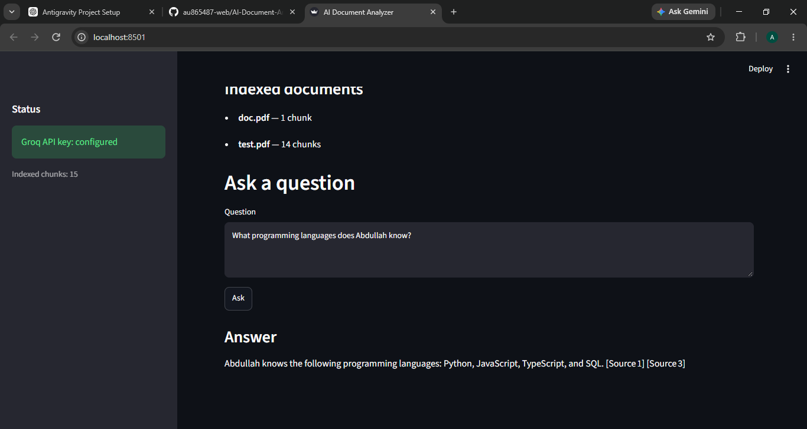
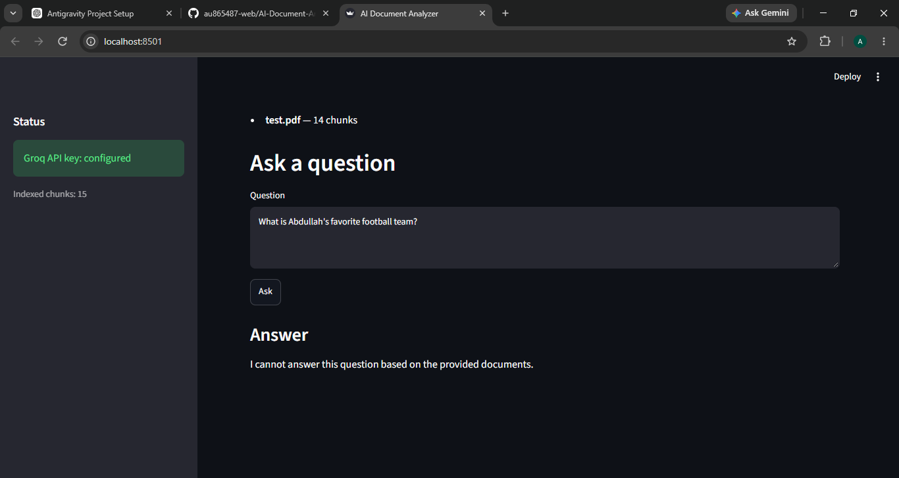

# AI Document Analyzer

A Python-based Retrieval-Augmented Generation (RAG) application that allows users to upload PDF/TXT documents, search them semantically, and ask questions grounded in those documents.

The system retrieves relevant document chunks, builds citation-ready context, and uses Groq's `openai/gpt-oss-20b` model to generate grounded answers with source citations.

> This project was built incrementally from the ingestion layer to a complete end-to-end RAG application. This README documents the final architecture, major engineering problems, and the solutions used to solve them.

---

## What It Does

The application follows this pipeline:

```text
PDF / TXT
    ↓
Text Extraction
    ↓
Cleaning
    ↓
Chunking + Page Metadata
    ↓
Embeddings
    ↓
FAISS Vector Store
    ↓
Semantic Retrieval
    ↓
Context Builder
    ↓
Groq LLM
    ↓
Answer + Citations
```

Users can upload documents, index them, and ask questions about their contents through a Streamlit interface.

The system is designed to avoid generating answers when the available documents do not provide enough information.

---

## Demo

The application provides a Streamlit interface for uploading documents, indexing them, asking questions, and viewing grounded answers with source citations.

### Document Upload & Indexing



### Grounded Answer with Citations



### Hallucination Prevention



### Example

```text
Question:
What programming languages does Abdullah know?

Answer:
Abdullah knows Python, JavaScript, TypeScript, and SQL.

Sources:
[Source 1] test.pdf (Page 1)
[Source 3] test.pdf (Page 1)

## Features

* PDF and TXT document ingestion
* Page-aware PDF extraction
* Text cleaning and normalization
* Metadata-aware chunking
* Sentence-transformer embeddings
* FAISS vector storage
* Cosine-similarity retrieval using normalized embeddings
* Multi-document indexing
* Document replacement and deletion
* Citation-aware context building
* Groq LLM answer generation
* Source, document, page, and chunk citations
* Hallucination-resistant fallback responses
* Streamlit UI
* Persistent FAISS index and metadata
* Automated test suite

---

## Tech Stack

| Component       | Technology            |
| --------------- | --------------------- |
| Language        | Python                |
| UI              | Streamlit             |
| PDF extraction  | PyMuPDF               |
| Embeddings      | Sentence Transformers |
| Embedding model | `all-MiniLM-L6-v2`    |
| Vector database | FAISS                 |
| LLM provider    | Groq                  |
| LLM             | `openai/gpt-oss-20b`  |
| Testing         | pytest                |

---

# Development Journey

The project was developed through multiple milestones rather than being built as one large application.

## M1 — Foundation

The initial project structure was created around separate responsibilities:

* ingestion
* cleaning
* chunking
* embeddings
* storage
* retrieval
* generation
* pipeline
* UI

The goal was to keep the system modular instead of putting the entire RAG pipeline into one file.

---

## M2 — Document Ingestion

PDF and TXT support was implemented.

One important requirement was preserving page information for PDFs so that answers could eventually point users back to the correct page.

The extraction layer therefore returns page-aware data rather than only one large text string.

---

## M3 — Cleaning & Chunking

Documents were cleaned and divided into smaller chunks before embedding.

### A Major Chunking Bug

During testing with the CV, the chunker unexpectedly produced:

```text
61 chunks
```

when the document should have produced roughly:

```text
14 chunks
```

The problem came from the overlap logic.

The original progression could fall back to advancing only one character:

```python
start = max(end - overlap, start + 1)
```

When the selected sentence boundary was too close to the current position, this caused extremely slow progress and created many unnecessary chunks.

The progression logic was changed so that the next chunk either advances beyond the current position or moves directly to the end of the current chunk.

After the fix:

```text
61 chunks → 14 chunks
```

All tests continued passing.

### Remaining Chunking Limitation

Some overlap chunks can still begin in the middle of a word.

This was intentionally left as a minor quality issue rather than introducing a larger chunking rewrite late in development.

---

# M4 — Embeddings

Documents and queries are converted into vector embeddings using:

```text
all-MiniLM-L6-v2
```

The same embedding model is used for both documents and queries.

The vectors are normalized and used with FAISS inner-product similarity, effectively providing cosine-similarity behavior.

---

# M5 — FAISS Vector Storage

The project initially used ChromaDB.

During development, the vector-storage layer was migrated to FAISS.

The final implementation uses:

```text
IndexIDMap2
    ↓
IndexFlatIP
```

with normalized vectors.

Metadata is stored separately so that the application can associate vector IDs with:

* document IDs
* chunk IDs
* chunk text
* page numbers

### Why This Mattered

The application needed more than vector similarity. It also needed to know:

> Which document did this result come from?

> Which page?

> Which chunk?

That metadata became important later for citations and document management.

---

# M6 — Semantic Retrieval

A retrieval layer was added on top of FAISS.

Questions are embedded and compared against the stored document vectors.

The retriever returns structured search results containing information such as:

* document ID
* chunk index
* text
* page number
* similarity score

---

# M6.5 — Page-Aware Retrieval

The ingestion and chunking pipeline was extended to preserve page numbers from PDFs.

This allows a retrieved result to contain information such as:

```text
Document: test.pdf
Page: 1
Chunk: 3
```

instead of only returning anonymous text.

This became the foundation for the citation system.

---

# M7.1 — Context Builder & Citations

A dedicated context-building layer was introduced between retrieval and the LLM.

Its job is to:

* remove duplicate chunks
* ignore empty results
* limit the number of sources
* enforce a context-character budget
* assign deterministic source IDs
* generate citation metadata

For example:

```text
[Source 1]

Document: test.pdf

Page: 1

<context>
```

The model can then reference:

```text
[Source 1]
```

instead of inventing its own citation format.

The application validates citations returned by the model and only exposes metadata for sources that actually exist in the retrieved context.

---

# M7.2 — Groq Answer Generation

Groq was integrated as the generation layer.

The current model is:

```text
openai/gpt-oss-20b
```

The generation system was designed with a strict grounding rule:

> Answer using the provided document context and do not guess when the information is unavailable.

This is important because a RAG application should not simply produce a plausible answer when the retrieved documents do not support it.

### Unsupported Questions

For questions outside the indexed documents, the system returns a safe fallback:

```text
I cannot answer this question based on the provided documents.
```

For example, when asked about a football team that isn't mentioned in the CV, the application correctly refuses to invent an answer.

---

# M8 — Streamlit UI

The final stage connected the RAG pipeline to a Streamlit interface.

The UI supports:

* uploading documents
* indexing documents
* viewing indexed documents
* asking questions
* displaying answers
* displaying citations
* showing relevant document/page/chunk information
* handling configuration and application errors

The UI is intentionally kept separate from the core pipeline.

The main orchestration is handled by:

```text
app/pipeline.py
```

while Streamlit is responsible for presentation.

---

# Engineering Problems We Faced

Building the project exposed several real problems that were not obvious from the initial design.

## 1. Chunk Explosion

**Problem**

The CV produced 61 chunks instead of 14.

**Cause**

The overlap algorithm could advance by only one character.

**Solution**

Fixed the chunk progression logic so every iteration makes meaningful forward progress.

**Result**

```text
61 → 14 chunks
```

---

## 2. ChromaDB → FAISS Migration

**Problem**

The original vector-storage approach was not the final architecture we wanted.

**Solution**

Migrated the storage layer to FAISS while preserving metadata and document-level operations.

This required handling:

* vector IDs
* metadata mapping
* document deletion
* persistence
* similarity search
* index loading

---

## 3. Persistent Metadata Inconsistency

During manual persistence testing, we encountered a confusing situation where:

```text
FAISS vectors: 15
```

but the active metadata file initially appeared to contain only one document/chunk.

A `.tmp` metadata file contained the newer state.

This initially looked like a persistence failure.

We tested the actual file replacement behavior and performed controlled save operations.

The final controlled tests showed that the synchronous `_save()` implementation was working correctly and the persisted state was healthy.

The project was left with the existing persistence implementation rather than rewriting a working storage layer based on a transient state.

---

## 4. Retrieval Ranking Problem

One of the most interesting problems appeared during testing.

The question:

```text
What is Abdullah's educational background?
```

did not initially retrieve the education section within the default retrieval depth.

When testing with a larger retrieval depth, the relevant education chunk appeared at approximately:

```text
#9
```

The chunk contained information including:

```text
SINDH BOARD — SECONDARY EDUCATION

Currently studying Grade 10
```

The original retrieval depth was:

```text
top_k = 8
```

So the relevant chunk was being excluded before the LLM ever received it.

The retrieval depth was therefore increased to:

```text
top_k = 10
```

and the context source limit was increased to:

```text
MAX_SOURCES = 10
```

This allows lower-ranked relevant results to reach the context-building stage.

### Important Remaining Limitation

Even after increasing retrieval depth, the natural-language education question can still produce the fallback response in the Streamlit UI.

This means the project still has a **retrieval-quality edge case**.

The issue was deliberately not turned into another major architecture change during finalization.

The system works correctly for the majority of tested questions, and the remaining issue is documented rather than hidden.

---

## 5. Hallucination Prevention

A RAG system can fail in two opposite ways:

1. Retrieve irrelevant information and confidently answer.
2. Refuse to answer even when the information exists.

The application was explicitly designed to prioritize grounded answers.

During testing:

```text
"What programming languages does Abdullah know?"
```

returned the correct information with citations.

An unsupported question such as:

```text
"What is Abdullah's favorite football team?"
```

correctly returned the fallback instead of inventing an answer.

This behavior is considered more important than forcing an answer for every question.

---

# Testing

The project has an automated test suite covering the main components and integration behavior.

Current final test result:

```text
149 passed
0 failed
```

Manual testing was also performed through the Streamlit UI.

### Programming Languages

The application correctly identified:

* Python
* JavaScript
* TypeScript
* SQL

with source citations.

### AI Projects

The application correctly identified multiple AI-related projects and provided citations.

### Databases

The application correctly identified PostgreSQL and SQL-related skills.

### Unsupported Information

The application correctly refused to answer information that was not present in the document.

### Known Edge Case

Educational-background questions can still fail when semantic retrieval ranks the relevant chunk too low.

---

# Project Structure

```text
app/
├── config.py          # Configuration and environment variables
├── ingestion/         # PDF/TXT extraction
├── cleaning/          # Text cleaning
├── chunking/          # Text chunking
├── embeddings/        # Document/query embeddings
├── storage/           # FAISS storage and metadata
├── retrieval/         # Semantic retrieval
├── context/           # Context construction and citations
├── generation/        # Groq LLM generation
├── ui/                # UI-independent user messages
└── pipeline.py        # End-to-end orchestration

streamlit_app.py       # Streamlit interface

data/
├── documents/         # Uploaded documents
├── faiss/             # FAISS index and metadata
└── chroma/            # Archived legacy vector store

tests/                 # Automated tests
```

---

# Setup

Create a virtual environment:

```powershell
python -m venv .venv
```

Activate it on Windows:

```powershell
.venv\Scripts\activate
```

Install dependencies:

```powershell
pip install -r requirements.txt
```

Create the environment file:

```powershell
copy .env.example .env
```

Add your Groq API key:

```env
GROQ_API_KEY=your_api_key_here
GROQ_MODEL=openai/gpt-oss-20b
```

Never commit a real API key.

---

# Run

Start the application:

```powershell
streamlit run streamlit_app.py
```

Run the tests:

```powershell
pytest -q
```

---

# Current Status

**Core RAG system: Complete ✅**

* document ingestion ✅
* cleaning ✅
* chunking ✅
* embeddings ✅
* FAISS storage ✅
* semantic retrieval ✅
* page metadata ✅
* context construction ✅
* citations ✅
* Groq generation ✅
* Streamlit UI ✅
* automated tests ✅

The project is now in the **final polish and portfolio stage**.

The remaining retrieval-quality edge case is known and documented rather than hidden.

---

# Future Improvements

Possible future improvements include:

* stronger retrieval/reranking
* better handling of broad questions
* improved chunk boundary detection
* additional document formats
* streaming responses
* conversation history
* authentication
* additional LLM providers
* more advanced document management

These are intentionally outside the current completed milestone.

---

# Author

**Abdullah Umer**

AI / Data Developer focused on building practical Python-based AI applications.

This project was built as a hands-on implementation of a complete RAG pipeline, from document ingestion and vector search to grounded LLM answers and source citations.
